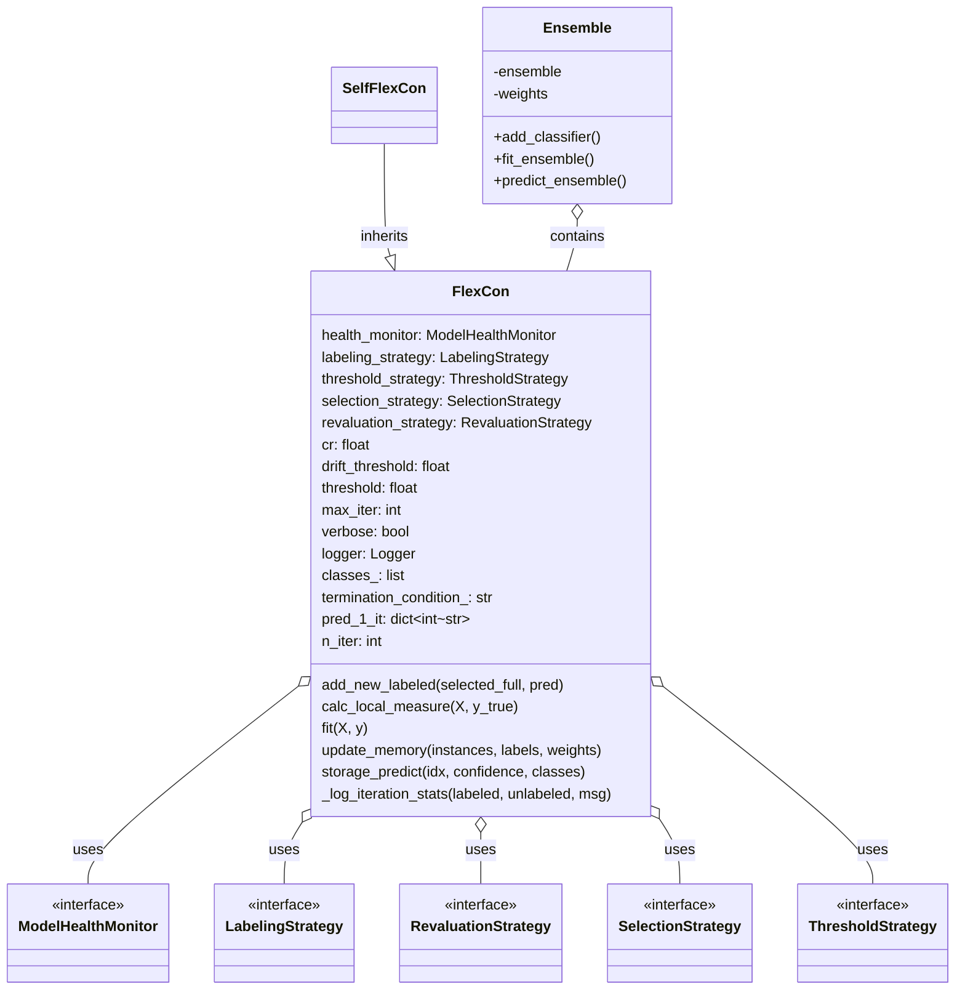
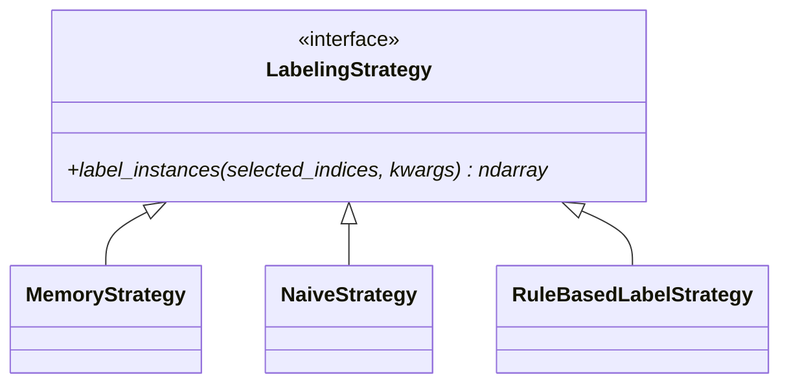
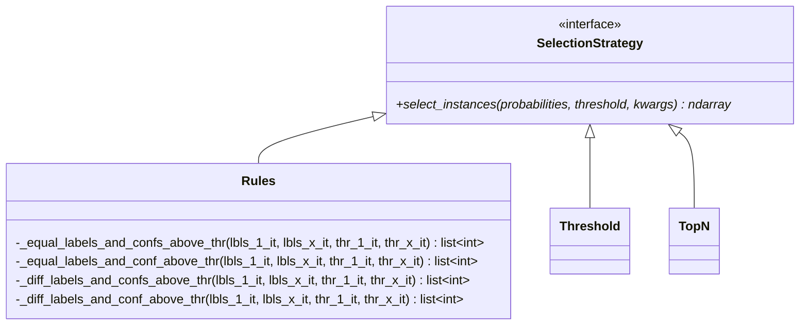
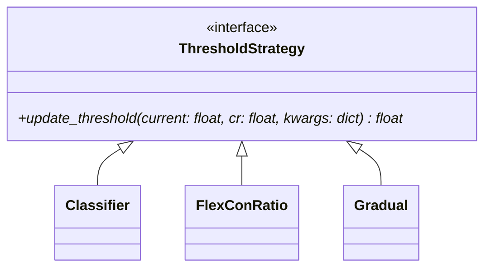
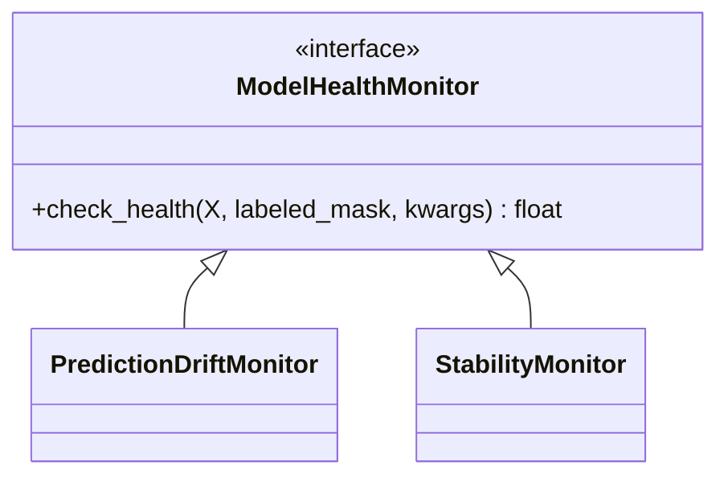
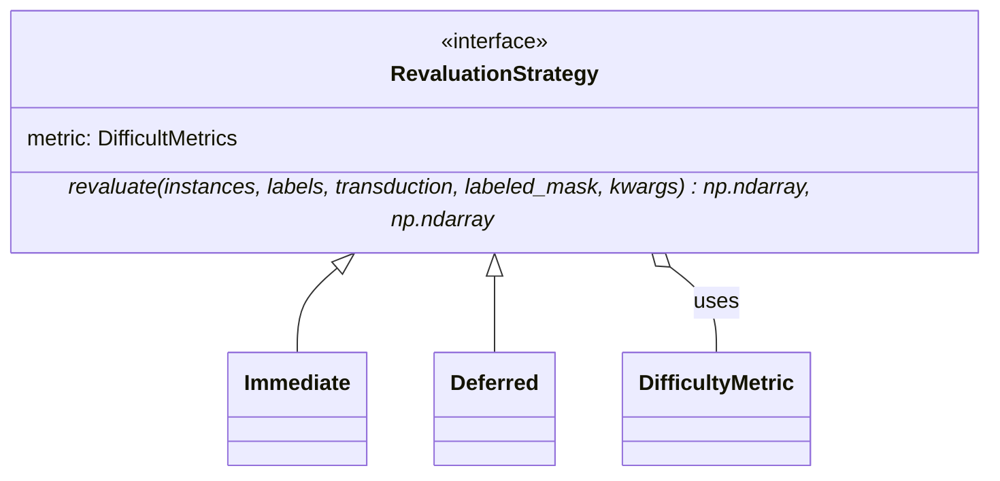
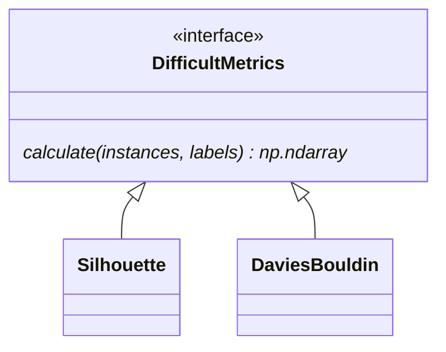

# Global view

```mermaid
classDiagram
    class ModelHealthMonitor <<interface>>
    class LabelingStrategy <<interface>>
    class RevaluationStrategy <<interface>>
    class SelectionStrategy <<interface>>
    class ThresholdStrategy <<interface>>

    %% Core Classes
    class FlexCon {
        %% deps injection
        health_monitor: ModelHealthMonitor
        labeling_strategy: LabelingStrategy
        threshold_strategy: ThresholdStrategy
        selection_strategy: SelectionStrategy
        revaluation_strategy: RevaluationStrategy

        cr: float
        drift_threshold: float
        threshold: float
        max_iter: int
        verbose: bool
        logger: Logger

        classes_: list
        termination_condition_: str
        pred_1_it: dict~int~str~
        n_iter: int

        add_new_labeled(selected_full, pred)
        calc_local_measure(X, y_true)
        fit(X, y)
        update_memory(instances, labels, weights)
        storage_predict(idx, confidence, classes)
        %% private modules
        _log_iteration_stats(labeled, unlabeled, msg)
    }

    class Ensemble {
        -ensemble
        -weights
        +add_classifier()
        +fit_ensemble()
        +predict_ensemble()
    }

    FlexCon o-- ModelHealthMonitor : uses
    FlexCon o-- LabelingStrategy : uses
    FlexCon o-- RevaluationStrategy : uses
    FlexCon o-- SelectionStrategy : uses
    FlexCon o-- ThresholdStrategy : uses
    SelfFlexCon --|> FlexCon : inherits

    Ensemble o-- FlexCon : contains
```

# Visão de cada interface em detalhes

## Label

```mermaid
classDiagram
%% Labeling Strategies (NEW)
    class LabelingStrategy {
        <<interface>>
        +label_instances(selected_indices, kwargs) ndarray*
    }

    LabelingStrategy <|-- MemoryStrategy
    LabelingStrategy <|-- NaiveStrategy
    LabelingStrategy <|-- RuleBasedLabelStrategy
```

## Selection

```mermaid
classDiagram
    %% Selection Strategies (UPDATED to return ONLY indices)
    class SelectionStrategy {
        <<interface>>
        +select_instances(probabilities, threshold, kwargs) ndarray*
    }
    class Rules {
        -_equal_labels_and_confs_above_thr(lbls_1_it, lbls_x_it, thr_1_it, thr_x_it) list~int~
        -_equal_labels_and_conf_above_thr(lbls_1_it, lbls_x_it, thr_1_it, thr_x_it) list~int~
        -_diff_labels_and_confs_above_thr(lbls_1_it, lbls_x_it, thr_1_it, thr_x_it) list~int~
        -_diff_labels_and_conf_above_thr(lbls_1_it, lbls_x_it, thr_1_it, thr_x_it) list~int~
    }

    SelectionStrategy <|-- Rules
    SelectionStrategy <|-- Threshold
    SelectionStrategy <|-- TopN
```

## Threshold

```mermaid
classDiagram
    %% Threshold Strategies
    class ThresholdStrategy {
        <<interface>>
        +update_threshold(current: float, cr: float, kwargs: dict) float*
    }

    ThresholdStrategy <|-- Classifier
    ThresholdStrategy <|-- FlexConRatio
    ThresholdStrategy <|-- Gradual
```

## HealthMonitor

```mermaid
classDiagram
    class ModelHealthMonitor {
        <<interface>>
        +check_health(X, labeled_mask, kwargs) float
    }

    ModelHealthMonitor <|-- PredictionDriftMonitor
    ModelHealthMonitor <|-- StabilityMonitor
```

## Revaluation

```mermaid
classDiagram
    %% Threshold Strategies
    class RevaluationStrategy {
        <<interface>>
        metric: DifficultMetrics

        revaluate(instances, labels, transduction, labeled_mask, kwargs) np.ndarray, np.ndarray*
    }

    RevaluationStrategy <|-- Immediate
    RevaluationStrategy <|-- Deferred

    RevaluationStrategy o-- DifficultyMetric : uses
```

## DifficultMetrics

```mermaid
classDiagram
    %% Threshold Strategies
    class DifficultMetrics {
        <<interface>>
        calculate(instances, labels) np.ndarray*
    }

    DifficultMetrics <|-- Silhouette
    DifficultMetrics <|-- DaviesBouldin

```
